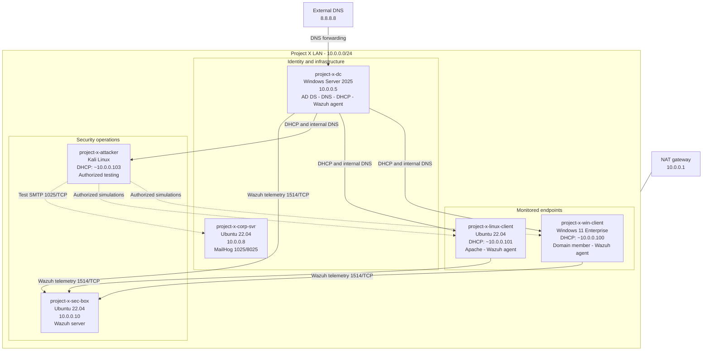

# Network Diagram

The following diagram represents the logical Project X homelab topology. Addresses marked as DHCP assignments are expected values and may change unless reservations are configured.

## Relationship notes

- `10.0.0.5` is the internal DNS server for lab clients.
- `8.8.8.8` is a DNS forwarder used by the DC for names it cannot resolve; domain clients should not bypass the DC and query it directly.
- The DC, Windows client, and Linux client send Wazuh telemetry to `10.0.0.10`.
- The Kali workstation is used only for authorized simulations against lab systems.
- MailHog captures test SMTP traffic on port `1025`; its browser interface is available on port `8025`.
- Apache on the Linux client is a telemetry-generation target, not a production application.

## Simplified data flows

| Flow | Path |
|---|---|
| Internal DNS | Client -> `10.0.0.5` |
| External DNS | Client -> DC -> `8.8.8.8` |
| Wazuh telemetry | Agent -> `10.0.0.10:1514/TCP` |
| Test email | Lab client -> `10.0.0.8:1025/TCP` |
| Mail review | Browser -> `10.0.0.8:8025/TCP` |
| Web test | Kali -> `10.0.0.101:80/TCP` |