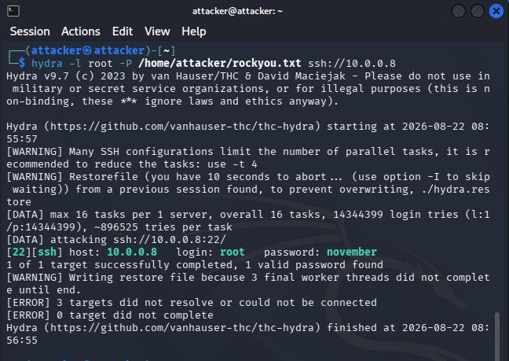
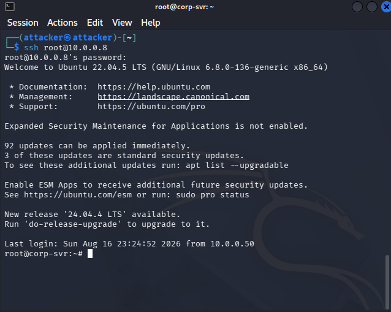

# Initial Access

## SSH Password Brute-Force (Hydra)

Reconnaissance confirmed that `corp-srv` (`10.0.0.8`) exposes SSH on port 22 with password authentication enabled. Since a valid username was not yet known, `root` was targeted first, as it is a common default/high-value account and a reasonable starting point in this controlled lab environment.

A password spraying/brute-force attack was performed using Hydra against the SSH service, using the `rockyou.txt` wordlist as the password source:

```bash
hydra -l root -P /home/attacker/rockyou.txt ssh://10.0.0.8
```

* `-l root` — Specifies a single, known login username (`root`) to test. (The uppercase `-L` flag would instead accept a *file* of multiple usernames.)
* `-P /home/attacker/rockyou.txt` — Points Hydra at a password list file, and tests every entry in it against the specified login.
* `ssh://10.0.0.8` — Defines the target protocol/service (`ssh`) and target IP address. Hydra uses this to know which login module to invoke and where to send attempts.

By default Hydra also runs multiple login attempts in parallel (16 tasks per target unless changed with `-t`) to speed up the attack, which is reflected in the tool's own output below.

### Results

Hydra successfully identified a valid credential pair on the first (and only) target:

| Service | Host      | Username | Password   |
| ------- | --------- | -------- | ---------- |
| SSH     | 10.0.0.8  | root     | `november` |

The tool reported `1 of 1 target successfully completed, 1 valid password found`, confirming the credentials work against the exposed SSH service.



**Figure 1 — Hydra SSH brute-force attack against `corp-srv` (`10.0.0.8`), recovering valid `root` credentials.**

### Notes / Observations

* Hydra flagged that many SSH server configurations rate-limit concurrent authentication attempts, and recommended reducing parallel tasks with `-t 4` to avoid errors or lockouts — worth keeping in mind on real engagements where noisy brute-forcing can trip account lockout policies or IDS/IPS alerting.
* A `hydra.restore` file is written periodically during a scan, allowing an interrupted attack to be resumed rather than restarted from scratch.
* In a real-world engagement, this kind of unthrottled, wordlist-based brute-force against an internet- or network-exposed SSH service would be extremely noisy and is generally a technique of last resort; it is used here deliberately to demonstrate the risk of weak/guessable passwords and the value of account lockout policies, rate limiting, and SSH key-based (rather than password) authentication.

## Validating Access

With the recovered credentials (`root` / `november`), the next step was to confirm they granted actual interactive access to `corp-srv`, rather than just being reported as valid by Hydra:

```bash
ssh root@10.0.0.8
```

When prompted, the password `november` was supplied. Authentication succeeded, dropping into an interactive shell as `root` on the target:



**Figure 2 — Successful SSH login to `corp-srv` (`10.0.0.8`) as `root` using credentials recovered via Hydra.**

The banner confirms the target is running **Ubuntu 22.04.5 LTS** (kernel `6.8.0-136-generic`), consistent with the Linux OS fingerprint from the earlier Nmap scan. The shell prompt `root@corp-srv:~#` confirms full, unrestricted `root`-level access was obtained — this is a complete compromise of the host via a single weak SSH password, with no further privilege escalation required.

### Next Step

With confirmed `root` access to `corp-srv`, the next phase moves into post-exploitation: situational awareness of the host, checking for persistence opportunities, and identifying paths to further objectives (e.g., lateral movement, data of interest, or pivoting toward the domain controller).