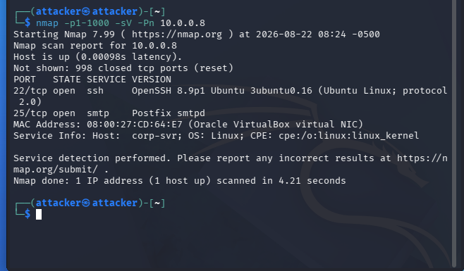
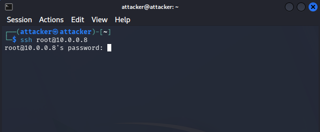

# Reconnaissance

## Nmap Service Scan

The first reconnaissance step is to identify open ports and running services on the target server.

For the sake of time in this home lab, the target IP `10.0.0.8` was already known. In a real-world assessment, the authorized subnet would normally be scanned first to identify active hosts:

```bash
nmap -sn 10.0.0.0/24
```

After identifying the target, the following service scan was performed:

```bash
nmap -p1-1000 -sV -Pn 10.0.0.8
```

* `-p1-1000` — Scans TCP ports 1–1000.
* `-sV` — Detects running services and versions.
* `-Pn` — Treats the target as online without host discovery.

### Results

| Port   | Service | Version              |
| ------ | ------- | -------------------- |
| 22/tcp | SSH     | OpenSSH 8.9p1 Ubuntu |
| 25/tcp | SMTP    | Postfix smtpd        |

Nmap also identified the hostname as `corp-srv` and the operating system as Linux.



**Figure 1 — Nmap service scan against `corp-srv` (`10.0.0.8`).**

## SSH Authentication Check

Since SSH was exposed on port 22, an SSH connection was attempted:

```bash
ssh root@10.0.0.8
```

The server responded with a password prompt, indicating that password-based authentication was available for further testing in the lab.



**Figure 2 — SSH connection attempt showing a password authentication prompt.**

### Next Step

Because SSH accepts password authentication, the next phase will perform controlled credential testing against the SSH service.
