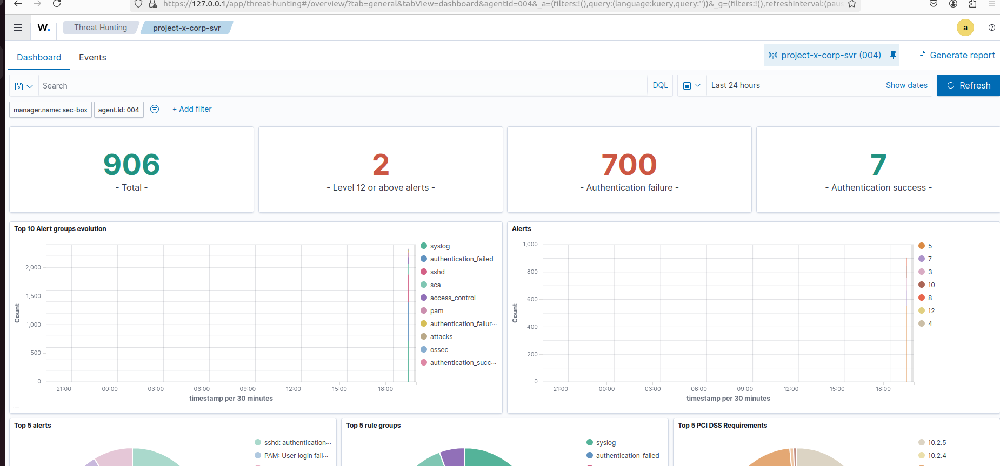
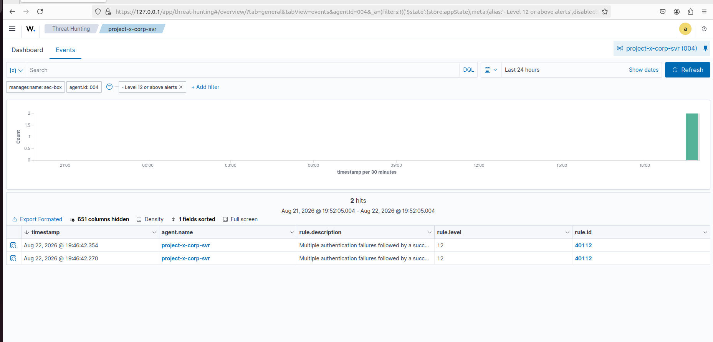

# Detection: SSH Brute-Force (Successful)

## Summary

After onboarding `corp-srv` as a Wazuh agent (`project-x-corp-svr`, agent ID `004`), the Hydra SSH brute-force attack documented in [`initial-access.md`](../initial-access.md) was re-run against the target to validate that Wazuh's default ruleset would detect it.

Wazuh's built-in correlation rule for SSH successfully fired, confirming both the failed authentication attempts **and** the eventual successful login as a single high-severity alert — without any custom rule authoring required.

## Locating the Alert

With the agent reporting, the **Threat Hunting** dashboard for `project-x-corp-svr` was reviewed over a 24-hour window. The overview showed a large volume of authentication activity generated by the attack:

* **906** total events
* **700** authentication failures
* **7** authentication successes
* **2** alerts at **Level 12 or above**



**Figure 1 — Threat Hunting dashboard for `project-x-corp-svr`, showing the spike in authentication failures generated by the Hydra attack and two Level 12+ alerts.**

Level 12 is notably higher than the default standalone "brute force" rule (which sits around level 10), so this was investigated first. Clicking into the **Level 12 or above alerts** card and switching to the **Events** tab isolated exactly two matching hits:



**Figure 2 — The two Level 12 alerts, both matching rule ID `40112`.**

## Alert Details

Both alerts matched **rule ID `40112`**, with the description:

> **Multiple authentication failures followed by a success.**

This is a built-in Wazuh correlation rule (part of the default `syslog`/`attacks` rule groups) — it doesn't fire on a single failed or successful login individually, but specifically when a source IP racks up repeated authentication failures and *then* succeeds shortly after. That pattern is a strong, low-noise indicator of a successful brute-force attack rather than a normal user mistyping their password once or twice.

Full alert data for one of the two hits:

```json
{
  "predecoder": {
    "hostname": "corp-svr",
    "program_name": "sshd",
    "timestamp": "Aug 22 19:46:41"
  },
  "agent": {
    "ip": "10.0.0.8",
    "name": "project-x-corp-svr",
    "id": "004"
  },
  "manager": {
    "name": "sec-box"
  },
  "data": {
    "srcip": "10.0.0.50",
    "dstuser": "root",
    "srcport": "51100"
  },
  "rule": {
    "level": 12,
    "description": "Multiple authentication failures followed by a success.",
    "groups": ["syslog", "attacks"],
    "id": "40112",
    "frequency": 2,
    "firedtimes": 2
  },
  "location": "/var/log/auth.log",
  "decoder": {
    "parent": "sshd",
    "name": "sshd"
  },
  "full_log": "Aug 22 19:46:41 corp-svr sshd[14976]: Accepted password for root from 10.0.0.50 port 51100 ssh2"
}
```

### Key Fields

| Field                | Value                                                        |
| -------------------- | ------------------------------------------------------------- |
| Rule ID               | `40112`                                                       |
| Rule level            | `12` (high severity)                                          |
| Rule description      | Multiple authentication failures followed by a success        |
| Source IP (`srcip`)   | `10.0.0.50` — attacker (Kali)                                 |
| Target user (`dstuser`)| `root`                                                        |
| Target host           | `corp-svr` (`10.0.0.8`)                                       |
| Log source            | `/var/log/auth.log`, parsed by the `sshd` decoder              |
| Underlying event      | `Accepted password for root from 10.0.0.50 port 51100 ssh2`   |

The alert also carries compliance framework mappings out of the box (PCI DSS `10.2.4`, `10.2.5`, `11.4`; HIPAA `164.312.b`; NIST 800-53 `AU.14`, `AC.7`, `SI.4`; GDPR `IV_35.7.d`, `IV_32.2`; TSC `CC6.1`, `CC6.8`, `CC7.2`, `CC7.3`; GPG13 `7.1`, `7.8`), which is useful context for framing this as a control satisfying specific audit/compliance requirements, not just a standalone alert.

This maps to MITRE ATT&CK **T1110 (Brute Force)** and, for the resulting access, **T1078 (Valid Accounts)**.

## Notes / Observations

* **No custom rule was needed** for this detection — rule `40112` is part of Wazuh's default ruleset and fired automatically once the agent began shipping `/var/log/auth.log` to the manager.
* The alert's `frequency: 2` / `firedtimes: 2` reflects that the underlying correlation condition (failures-then-success) was satisfied twice in this run; the raw failure count (700) is captured separately by the lower-severity per-failure rules, keeping this particular alert focused and low-noise rather than generating hundreds of individual alerts.
* This confirms the earlier assessment: SSH brute-force detection comes "for free" with a correctly onboarded agent, whereas detecting the Nmap reconnaissance phase of this same attack chain still requires a NIDS (e.g. Suricata) layered on top, since Wazuh's HIDS model only sees what gets logged locally.
* Next planned step: author a custom `local_rules.xml` rule tuned to a tighter frequency/timeframe than the defaults (e.g. 5 failures in 60 seconds) to reduce time-to-detection, and pair it with an Active Response `firewall-drop` rule to automatically block the source IP once rule `40112` (or a custom equivalent) fires.
